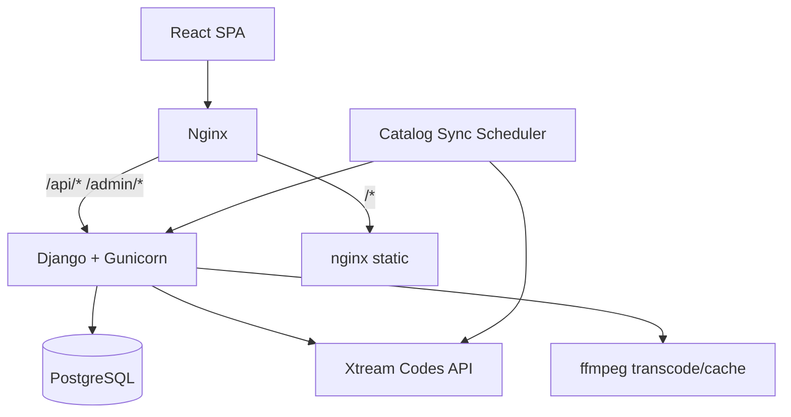

# IPTV Gateway — Contexto para Claude

Documento de referencia del proyecto en `/opt/iptv-gateway`. Úsalo como contexto al trabajar en este repositorio.

**Producción:** https://ea-iptv.leyluz.com (nginx en puerto 8080 local)  
**Proveedor Xtream:** `line.trxdnscloud.ru` (configurado en `XTREAM_SERVER_URL`)

---

## Resumen

Gateway IPTV multi-usuario que expone un catálogo Xtream Codes (live, VOD, series) mediante una API Django REST + frontend React. Cada usuario del gateway tiene su propia sesión y se le asigna una cuenta IPTV del proveedor con límite de conexiones simultáneas.

El catálogo completo (~200k películas) se indexa en PostgreSQL para búsqueda y listados paginados rápidos. La reproducción pasa por proxies que transcodifican con ffmpeg cuando el navegador no puede reproducir el formato nativo del proveedor.

---

## Stack

| Capa | Tecnología |
|------|------------|
| Backend | Django 5, DRF, SimpleJWT, Gunicorn (2 workers, 4 threads) |
| Frontend | React 19, Vite 7, React Router 7 |
| Reproductor | mpegts.js (live TS), Hls.js (HLS), `<video>` nativo (MP4) |
| Base de datos | PostgreSQL 16 |
| Proxy reverso | nginx 1.27 |
| Contenedores | Docker Compose (db, backend, frontend, nginx) |
| Transcodificación | ffmpeg + ffprobe (en contenedor backend) |

---

## Arquitectura



### Flujo de autenticación

1. Usuario hace login → `POST /api/token/` (JWT access + refresh).
2. Frontend llama `POST /api/session/start` → asigna cuenta IPTV con capacidad.
3. Heartbeat cada 60 s → `POST /api/session/heartbeat`.
4. Sesión inactiva > `SESSION_INACTIVITY_MINUTES` (default 5) libera la cuenta.

### Flujo de reproducción

1. Frontend pide URL de play → `/api/catalog/{live|vod|series}/.../play`.
2. Backend devuelve URL firmada al proxy → `/api/proxy/play?token=...`.
3. Proxy obtiene credenciales de la sesión activa del usuario y stream del proveedor.
4. Si el codec no es compatible con el navegador, ffmpeg transcodifica a MP4 fragmentado (streaming inmediato + caché en background).
5. Imágenes del catálogo pasan por `/api/proxy/media?token=...`.

---

## Estructura del repositorio

```
/opt/iptv-gateway/
├── .env                          # Configuración (NO commitear secretos)
├── docker-compose.yml
├── nginx/default.conf            # Proxy /api → backend, / → frontend
├── CLAUDE.md                     # Este archivo
│
├── backend/
│   ├── gateway/                  # settings.py, urls.py, wsgi
│   ├── accounts/                 # IPTVAccount, cifrado Fernet, seed
│   ├── sessions/                 # UserSession, asignación de cuentas
│   ├── library/                  # CatalogItem, sync, búsqueda, progreso
│   │   ├── catalog_sync.py       # Sincronización del índice (core)
│   │   ├── search.py             # Búsqueda por tokens en PostgreSQL
│   │   └── management/commands/
│   │       ├── sync_catalog_index.py
│   │       └── enrich_vod_cast.py
│   ├── api/
│   │   ├── urls.py               # Todas las rutas API
│   │   ├── catalog_views.py      # Catálogo live/vod/series
│   │   ├── catalog_list.py       # Listados paginados desde índice DB
│   │   ├── proxy_views.py        # Proxy media/play/subtitle/segment
│   │   ├── stream_utils.py       # ffmpeg, análisis, caché transcode
│   │   ├── xtream.py             # Cliente Xtream Codes API
│   │   ├── search_views.py       # Búsqueda + status/sync
│   │   └── library_views.py      # Seguir viendo, historial, progreso
│   └── entrypoint.sh             # migrate, seed, gunicorn
│
└── frontend/src/
    ├── api.js                    # Cliente HTTP + JWT refresh
    ├── App.jsx                   # Rutas
    ├── hooks/usePaginatedCatalog.js
    ├── pages/
    │   ├── Home.jsx              # Inicio con filas destacadas
    │   ├── Live.jsx              # TV en vivo
    │   ├── Movies.jsx            # Películas
    │   ├── Series.jsx            # Series
    │   ├── SeriesDetail.jsx      # Episodios de una serie
    │   ├── Login.jsx
    │   └── Settings.jsx
    └── components/
        ├── Player.jsx            # Reproductor unificado
        ├── CatalogLoadOverlay.jsx
        ├── ContinueWatchingRow.jsx
        ├── SearchBar.jsx
        ├── MediaCard.jsx
        └── Navbar.jsx
```

---

## Usuarios y cuentas

### Usuarios API (login del gateway)

| Usuario | Cuenta IPTV dedicada |
|---------|---------------------|
| luken   | Luken               |
| rebe    | Rebe                |
| helios  | Helios              |
| carmen  | Carmen              |
| arturo  | Arturo              |

- Login JWT: username en minúsculas + contraseña de `IPTV_USER_<NOMBRE>_PASSWORD` (o la del proveedor si no se define).
- Cada cuenta IPTV tiene `max_connections=2`.
- Si el usuario tiene cuenta dedicada con capacidad, se usa esa; si no, se asigna la menos cargada.

### Variables de entorno (`.env`)

```env
# Django / DB
POSTGRES_PASSWORD=...
DJANGO_SECRET_KEY=...
DJANGO_ALLOWED_HOSTS=ea-iptv.leyluz.com,localhost,127.0.0.1
CSRF_TRUSTED_ORIGINS=https://ea-iptv.leyluz.com
CORS_ORIGINS=https://ea-iptv.leyluz.com

# Proveedor
XTREAM_SERVER_URL=line.trxdnscloud.ru

# Por cada cuenta (LUKEN, REBE, HELIOS, CARMEN, ARTURO):
IPTV_ACCOUNT_<NOMBRE>_USERNAME=...   # usuario real Xtream
IPTV_ACCOUNT_<NOMBRE>_PASSWORD=...   # contraseña real Xtream
IPTV_USER_<NOMBRE>_PASSWORD=...      # contraseña login gateway (opcional)

# Sesiones
SESSION_INACTIVITY_MINUTES=5

# Sincronización de catálogo
CATALOG_SYNC_INTERVAL_HOURS=4        # cada cuántas horas reindexar
CATALOG_SYNC_CATEGORY_WORKERS=10     # paralelismo por categorías
CATALOG_SYNC_ACCOUNT_WORKERS=5       # paralelismo por cuentas IPTV
CATALOG_ENRICH_CAST_ON_SYNC=true     # enriquecer reparto en background
CATALOG_ENRICH_BATCH_LIMIT=300       # películas por ciclo de enrich

# Opcional
IPTV_ENCRYPTION_KEY=                 # Fernet; si vacío deriva de SECRET_KEY
DJANGO_SUPERUSER_USERNAME=admin
DJANGO_SUPERUSER_PASSWORD=...
```

`seed_initial_data` (en entrypoint) sincroniza cuentas y usuarios desde estas variables.

---

## Catálogo indexado

### Conteos actuales (última sync)

| Tipo | Cantidad |
|------|----------|
| Películas (VOD) | ~201.465 |
| Series | ~43.667 |
| TV en vivo | ~20.078 |

Se indexan **todas las cuentas IPTV habilitadas** y se deduplican por `item_id`.

### Sincronización automática

- Programador en `library/apps.py` → `start_catalog_sync_scheduler()`.
- Revisa cada 5 min si toca sincronizar (intervalo = `CATALOG_SYNC_INTERVAL_HOURS`).
- Bloqueo PostgreSQL advisory lock → solo un worker sincroniza a la vez.
- Paralelismo: categorías × cuentas × tipos (live/vod/series) en paralelo.
- Durante sync: `use_cache=False` en peticiones Xtream (datos frescos).
- Tras sync: enrich de reparto VOD en background (300/ciclo, no bloquea).

### Comandos manuales

```bash
# Reindexar catálogo completo
docker compose exec backend python manage.py sync_catalog_index --force

# Enriquecer reparto de películas (búsqueda por actor)
docker compose exec backend python manage.py enrich_vod_cast --workers 4
```

### API de catálogo paginado

```
GET /api/catalog/live/streams?category_id=all&paginated=1&offset=0&limit=300
GET /api/catalog/vod/streams?category_id=<id|all>&paginated=1&offset=0&limit=300
GET /api/catalog/series?category_id=<id|all>&paginated=1&offset=0&limit=300
```

Respuesta paginada: `{ total, offset, limit, items: [...] }`  
Sin `paginated=1` devuelve solo el array `items` (legacy).

Si el índice DB está listo (`catalog_index_ready()`), responde desde PostgreSQL; si no, consulta Xtream en vivo y pagina en memoria.

### Búsqueda

```
GET /api/catalog/search?q=termino&type=vod|live|series&limit=40
GET /api/catalog/search/status    # estado sync + conteos + next_sync_at
POST /api/catalog/search/sync     # forzar sync manual (202 Accepted)
```

Búsqueda por tokens en `search_text` / `name_normalized` (mínimo 2 caracteres).

---

## API completa

Todas las rutas bajo `/api/`. Autenticación: `Authorization: Bearer <access_token>` excepto proxies con token firmado en query.

### Auth y sesión

| Método | Ruta | Descripción |
|--------|------|-------------|
| POST | `/token/` | Login JWT |
| POST | `/token/refresh/` | Renovar access |
| POST | `/session/start` | Iniciar sesión IPTV |
| POST | `/session/heartbeat` | Mantener sesión |
| POST | `/session/end` | Cerrar sesión |
| GET | `/session/current` | Sesión activa |

### Catálogo

| Método | Ruta | Descripción |
|--------|------|-------------|
| GET | `/catalog/live/categories` | Categorías TV |
| GET | `/catalog/live/streams` | Canales (paginado) |
| GET | `/catalog/live/<id>/play` | URL play live |
| GET | `/catalog/live/<id>/epg` | EPG corto |
| GET | `/catalog/vod/categories` | Categorías películas |
| GET | `/catalog/vod/streams` | Películas (paginado) |
| GET | `/catalog/vod/<id>/play` | URL play VOD + tracks |
| GET | `/catalog/series/categories` | Categorías series |
| GET | `/catalog/series` | Series (paginado) |
| GET | `/catalog/series/<id>` | Info + episodios |
| GET | `/catalog/series/episode/<id>/play` | URL play episodio |

Play VOD/series devuelve: `url`, `duration_seconds`, `tracks.audio[]`, `tracks.subtitles[]`.

### Biblioteca del usuario

| Método | Ruta | Descripción |
|--------|------|-------------|
| GET | `/library/continue` | Seguir viendo |
| GET | `/library/history` | Historial |
| POST | `/library/history/record` | Registrar vista |
| GET/PUT/DELETE | `/library/progress/<type>/<id>` | Progreso de reproducción |

### Proxy (tokens firmados, AllowAny)

| Ruta | Descripción |
|------|-------------|
| `/proxy/media` | Imágenes del catálogo |
| `/proxy/play` | Stream de video |
| `/proxy/subtitle` | Subtítulos VTT |
| `/proxy/segment` | Segmentos HLS reescritos |

### Diagnósticos

| Método | Ruta | Descripción |
|--------|------|-------------|
| GET | `/diagnostics/config` | Config visible |
| POST | `/diagnostics/run` | Prueba conectividad |

---

## Modelos principales (PostgreSQL)

### `IPTVAccount` (accounts)
- `name`, `username`, `password_encrypted` (Fernet)
- `max_connections`, `enabled`

### `UserSession` (sessions)
- Usuario gateway → cuenta asignada, `last_seen`, status active/expired

### `CatalogItem` (library)
- Índice unificado: `content_type` + `item_id` (unique)
- Campos: name, category, image_url, year, rating, cast_display, search_text, extra (JSON)

### `CatalogSyncState` (library)
- Estado de sync: status, counts, timestamps, error

### `WatchProgress` / `ViewHistory` (library)
- Progreso y historial por usuario

---

## Frontend — Rutas y funcionalidades

| Ruta | Página | Funcionalidad |
|------|--------|---------------|
| `/login` | Login | JWT + session start |
| `/` | Home | Filas live/movies/series, seguir viendo, canales recientes |
| `/tv` | Live | Catálogo paginado, pestaña "Todas", scroll infinito |
| `/movies` | Movies | Idem + seguir viendo + búsqueda |
| `/series` | Series | Idem |
| `/series/:id` | SeriesDetail | Temporadas y episodios |
| `/settings` | Settings | Configuración usuario |

### Catálogo en frontend

- Hook `usePaginatedCatalog(type)` — live/vod/series, 300 ítems/página, scroll infinito.
- `CatalogLoadOverlay` — pantalla de carga con progreso.
- Pestaña **"Todas"** (`category_id=all`) en Live, Movies y Series.

### Player (`Player.jsx`)

**Live:**
- mpegts.js para streams `.ts`
- Zapping estilo IZZI: ↑↓ cambiar canal, `G` guía de canales, banner de canal
- EPG en overlay
- Audio mute inicial hasta interacción del usuario

**VOD / Series:**
- Hls.js o `<video>` nativo según URL
- Barra de progreso custom: rojo=visto, gris claro=buffer, fondo=duración total
- Selector de pista de audio y subtítulos
- Reanudar desde `WatchProgress`
- Guardar progreso periódicamente

---

## Despliegue

```bash
cd /opt/iptv-gateway

# Build y levantar todo
docker compose up -d --build

# Solo backend
docker compose up -d --build backend

# Logs
docker compose logs -f backend

# Shell Django
docker compose exec backend python manage.py shell
```

Puertos:
- **8080** → nginx (entrada pública)
- **5434** → PostgreSQL (host)

---

## Archivos clave para cambios frecuentes

| Tarea | Archivos |
|-------|----------|
| Nuevo endpoint API | `backend/api/urls.py`, vista correspondiente |
| Catálogo / paginación | `catalog_views.py`, `catalog_list.py`, `catalog_sync.py` |
| Reproducción / transcode | `proxy_views.py`, `stream_utils.py` |
| Búsqueda | `library/search.py`, `search_views.py` |
| UI catálogo | `usePaginatedCatalog.js`, páginas Live/Movies/Series |
| Reproductor | `Player.jsx`, `api.js` (`buildPlayerSession`) |
| Sync automático | `catalog_sync.py`, `library/apps.py`, `.env` |
| Cuentas/usuarios | `.env`, `seed_initial_data.py` |

---

## Problemas conocidos y gotchas

1. **`handle_exception` vs `dispatch`** en vistas DRF: usar `handle_exception()` para capturar `XtreamError`/`SessionError` sin romper el renderer.

2. **History 400**: URLs de imagen proxy no son URLField válidas → serializer usa `CharField` para `image`.

3. **Transcode bloqueante**: VOD/series usan `ffmpeg_browser_mp4_stream` (streaming fmp4 inmediato); no esperar transcode completo antes de responder.

4. **`enrich_vod_cast`**: puede saturar workers si se corre agresivo; limitado a 300/ciclo en sync automática.

5. **Caché Xtream**: 10 min TTL en requests normales; desactivado durante sync (`use_cache=False`).

6. **Gunicorn multi-worker**: el scheduler usa advisory lock PG; no duplicar sync.

7. **Home.jsx** aún carga solo 24 ítems de la primera categoría (no usa paginación completa).

8. **Migraciones pendientes**: `iptv_sessions` puede tener cambios sin migrar (warning en logs).

---

## Historial de desarrollo (contexto)

- Gateway multi-cuenta con sesiones y límite de conexiones.
- Reproductor unificado live/VOD/series con ffmpeg para compatibilidad browser.
- Zapping TV estilo IZZI (↑↓, guía, banner).
- Índice PostgreSQL para búsqueda y catálogos grandes.
- Paginación + scroll infinito + overlay de carga en Live/Movies/Series.
- Sync automático cada 4h de todas las cuentas (~200k películas).
- Seguir viendo, historial, progreso, subtítulos, selector de audio.
- Barra de tiempo con duración total y buffer separado.

---

## Convenciones al contribuir

- Respuestas al usuario en **español**.
- No commitear `.env` ni secretos.
- Cambios mínimos y enfocados; seguir estilo existente.
- Deploy: `docker compose up -d --build` tras cambios backend/frontend.
- Probar endpoints paginados con `paginated=1&category_id=all`.
- Solo crear commits cuando el usuario lo pida explícitamente.
