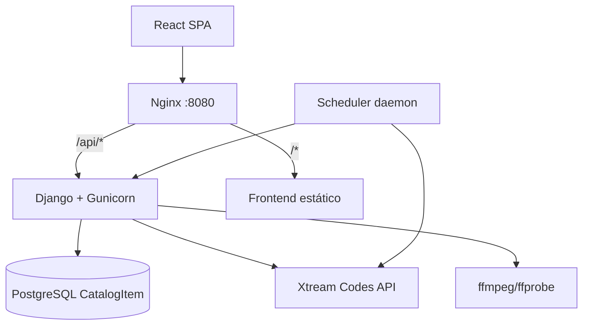
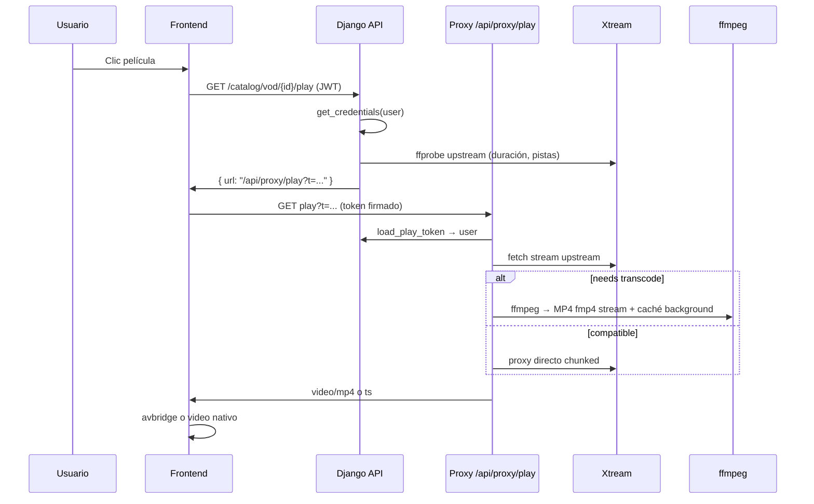

# Reporte técnico: implementación del sistema IPTV Gateway

Documento de auditoría del repositorio `/opt/iptv-gateway`.

**Producción:** https://ea-iptv.leyluz.com  
**Proveedor Xtream:** configurado en `XTREAM_SERVER_URL` (`.env`)

---

## Resumen ejecutivo

El gateway es una capa intermedia entre usuarios (React + JWT) y un proveedor **Xtream Codes**. No hay Celery ni cron externo: un **scheduler en hilo daemon** dentro de Django sincroniza el catálogo a PostgreSQL. La reproducción **nunca expone credenciales Xtream al navegador**: todo pasa por URLs firmadas (`/api/proxy/...`) que el backend resuelve con la sesión IPTV del usuario.



---

## 1. Consumo del API de IPTV (Xtream Codes)

### 1.1 ¿Dónde está el cliente?

Archivo central: `backend/api/xtream.py`.

- URL base: variable de entorno `XTREAM_SERVER_URL` (`gateway/settings.py` líneas 132–134).
- API JSON: `{server}/player_api.php`.
- Streams directos (sin `player_api.php`):
  - Live: `/live/{user}/{pass}/{id}.ts`
  - VOD: `/movie/{user}/{pass}/{id}.{ext}`
  - Series: `/series/{user}/{pass}/{episode_id}.{ext}`

```python
# backend/api/xtream.py
def _player_api_url() -> str:
    return f'{_server_url()}/player_api.php'

def live_stream_url(username, password, stream_id):
    return f'{_server_url()}/live/{username}/{password}/{stream_id}.ts'

def vod_stream_url(username, password, stream_id, ext='mp4'):
    return f'{_server_url()}/movie/{username}/{password}/{stream_id}.{ext}'

def series_stream_url(username, password, episode_id, ext='mp4'):
    return f'{_server_url()}/series/{username}/{password}/{episode_id}.{ext}'
```

Todas las acciones API usan GET con `username`, `password`, `action` y parámetros extra (`xtream_raw_request`, timeout 60 s).

**Caché en memoria del proceso:** TTL 600 s (10 min), por `(username, action, params)`.

### 1.2 Endpoints del proveedor usados

| Action Xtream | Uso | Archivo |
|---------------|-----|---------|
| `get_live_categories` | Categorías TV | `catalog_views.py` (siempre live) |
| `get_live_streams` | Canales | sync + fallback live |
| `get_vod_categories` | Categorías películas | siempre live |
| `get_vod_streams` | Películas | sync + fallback |
| `get_series_categories` | Categorías series | siempre live |
| `get_series` | Listado series | sync + fallback |
| `get_series_info` | Episodios de una serie | `catalog_views.py` (siempre live) |
| `get_short_epg` | EPG canal | `catalog_views.py` |
| `get_vod_info` | Enriquecer reparto VOD | `catalog_sync.py` |
| `get_account_info` | Diagnóstico | `diagnostics_views.py` |

El sync de catálogo usa `use_cache=False` para datos frescos (`library/catalog_sync.py`).

### 1.3 Credenciales: ¿dónde viven?

| Capa | Origen | Persistencia |
|------|--------|--------------|
| Login gateway | `IPTV_USER_<NOMBRE>_PASSWORD` en `.env` | Usuario Django (seed) |
| Cuenta IPTV proveedor | `IPTV_ACCOUNT_<NOMBRE>_USERNAME/PASSWORD` en `.env` | PostgreSQL `IPTVAccount`, cifrado Fernet |
| Runtime reproducción | Sesión activa del usuario | `UserSession.account_assigned` → credenciales descifradas |

Seed env → DB: `accounts/management/commands/seed_initial_data.py`.

Cifrado: `accounts/encryption.py` (Fernet con `IPTV_ENCRYPTION_KEY` o derivada de `SECRET_KEY`).

En runtime, cada petición Xtream obtiene credenciales vía `get_credentials(user)` → `ensure_session` → `IPTVAccount.get_password()`.

**No hay credenciales hardcodeadas** en código de producción; solo nombres fijos de cuentas en el seed (`Luken`, `Rebe`, `Helios`, `Carmen`, `Arturo`).

### 1.4 ¿Cada cuánto se consulta el catálogo?

**No hay Celery, cron ni beat.** Hay un scheduler interno:

- Arranque: `library/apps.py` → `start_catalog_sync_scheduler()`.
- **Intervalo de sync:** `CATALOG_SYNC_INTERVAL_HOURS` (default **4 h**, `gateway/settings.py`).
- **Poll del scheduler:** cada **300 s** (5 min) revisa si toca sincronizar.
- **Lock:** PostgreSQL advisory lock (`83927401`) para que solo un worker Gunicorn sincronice a la vez.
- **Comando manual:** `python manage.py sync_catalog_index --force`.
- **API manual:** `POST /api/catalog/search/sync`, `POST /api/catalog/refresh?force=1`.

Condición para sync automático (`should_run_scheduled_sync`):

- Catálogo vacío → sync inmediato.
- Nunca sincronizado → sync.
- Pasaron ≥ `CATALOG_SYNC_INTERVAL_HOURS` desde `finished_at` → sync.

### 1.5 ¿Caché en DB o todo en vivo?

**Modelo híbrido:**

| Dato | Fuente |
|------|--------|
| Listados paginados live/vod/series (`paginated=1`) | **PostgreSQL** `CatalogItem` si índice listo |
| Búsqueda (`/api/catalog/search`) | **Solo PostgreSQL** |
| Categorías (`/categories`) | **Siempre Xtream en vivo** |
| Detalle serie + episodios (`get_series_info`) | **Siempre Xtream en vivo** |
| EPG | **Siempre Xtream en vivo** |
| Play URL | Siempre generada al momento (ffprobe + token) |

Decisión en listados (`catalog_views.py`):

```python
if catalog_index_ready():
    payload = list_catalog_from_index(...)
else:
    data = rewrite_catalog_list(request, _fetch_xtream_catalog(...))
```

**Caché adicional:**

- Xtream API: memoria 10 min (`xtream.py`).
- Transcode VOD: disco `/tmp/iptv-transcode-cache` (`IPTV_TRANSCODE_CACHE`).
- Metadatos ffprobe (duración, pistas): memoria 10 min (`stream_utils.py`).

---

## 2. Persistencia de conexión

### 2.1 Autenticación contra el proveedor

**No hay sesión persistente con Xtream.** Cada request al proveedor lleva `username` + `password` en query string (API) o en la URL del stream.

Lo que sí persiste es la **sesión del gateway** (`sessions/models.py` → `UserSession`):

| Campo | Descripción |
|-------|-------------|
| `user_identifier` | Username gateway |
| `account_assigned` | FK a `IPTVAccount` |
| `status` | active / ended / expired |
| `last_seen` | Actualizado en heartbeat |

Flujo frontend:

1. `POST /api/token/` → JWT.
2. `POST /api/session/start` → asigna `IPTVAccount`.
3. `POST /api/session/heartbeat` cada 60 s (`App.jsx`).
4. Inactividad > `SESSION_INACTIVITY_MINUTES` (default 5) → sesión `expired`.

### 2.2 Control de `max_connections`

Modelo `IPTVAccount` (`accounts/models.py`):

- `max_connections` default **2**.
- `active_connections`: cuenta sesiones `UserSession` con status `active`.
- `has_capacity()`: `active_connections < max_connections`.

Asignación (`sessions/services.py`):

1. Cuenta dedicada cuyo `name` coincide con el username gateway (ej. `luken` → cuenta `Luken`).
2. Si no hay capacidad, cuenta habilitada con **menor carga**.
3. Transacción con `select_for_update` antes de crear sesión.

El gateway **no consulta** `max_connections` al proveedor en tiempo real; usa su propio contador interno.

### 2.3 Fallos del proveedor: timeouts, reintentos, fallback

**Backend — Xtream API:**

- Timeout: **60 s**.
- Sin reintentos automáticos.
- Errores → `XtreamError` → HTTP 502.

**Backend — proxy upstream:**

- Timeout fetch: `(10, 120)` s connect/read (`proxy_views.py`).
- Probe HEAD: 12 s.

**Backend — transcode:**

- ffprobe: 90 s.
- ffmpeg cache completo: hasta 60 min.
- Si `_serve_browser_compatible` falla → fallback a **proxy directo** del stream original.

**Frontend — live:**

- Reconexión exponencial 2.5–30 s.
- Stall detector cada 4 s.
- Fallback mpegts → avbridge → reconexión con nueva URL play.

**Frontend — VOD:**

- avbridge → escalación hybrid/fallback → transcode servidor.
- MKV/AVI/WMV/FLV/TS/WebM → transcode servidor primero.

**No hay fallback a otro proveedor.**

---

## 3. Adquisición de imágenes

### 3.1 ¿De dónde se sirven?

**Hotlink indirecto vía proxy propio.** URLs originales del proveedor se reescriben a `/api/proxy/media?t=<token>`:

```python
# backend/api/catalog_utils.py
def proxy_media_url(request, original_url):
    token = make_media_token(original_url)
    return f'/api/proxy/media?{_token_query(token)}'
```

Campos reescritos: `stream_icon`, `cover`, `cover_big`.

### 3.2 ¿Se descargan y guardan?

**No hay storage propio (S3, disco, etc.).** `MediaProxyView` hace fetch al proveedor en cada petición:

- Token firmado con URL original, validez **24 h** (`MEDIA_MAX_AGE`).
- `Cache-Control: public, max-age=86400` → caché del **navegador** 24 h.
- User-Agent MAG200 al upstream.

**Frontend:** `MediaCard.jsx` solo renderiza la URL recibida; no hay descarga local.

---

## 4. Reproductores

### 4.1 Formatos de stream

| Tipo | Formato upstream típico | Formato al navegador |
|------|-------------------------|----------------------|
| Live | `.ts` (MPEG-TS) | TS vía mpegts.js, o HLS, o H.264 transcode |
| VOD | `.mp4`, `.mkv`, `.avi`, etc. | MP4 nativo/avbridge o MP4 transcodificado |
| Series | Igual VOD | Igual VOD |
| Live HLS | `.m3u8` | Manifiesto reescrito + segmentos proxy |

### 4.2 Librerías frontend

Archivo: `frontend/src/components/Player.jsx`.

| Motor | Librería | Cuándo |
|-------|----------|--------|
| Live primario | **mpegts.js** | MSE live playback disponible |
| Live fallback | **hls.js** | Sin MSE live |
| Live Safari | `<video>` nativo | `canPlayType('application/vnd.apple.mpegurl')` |
| VOD compatible | **avbridge** 2.13 | MP4/MOV vía proxy (`client_decode=1`) |
| VOD legacy | **ffmpeg servidor** | MKV, AVI, WMV, FLV, TS, WebM |
| Fallback live codec | **avbridge** | Error codec en mpegts |
| Subtítulos | `<track>` + proxy VTT | VOD/series |

Dependencias: `avbridge`, `hls.js`, `mpegts.js` (`frontend/package.json`).

Utilidad avbridge: `frontend/src/utils/avbridgePlayer.js` (`backgroundBehavior: 'continue'`, caché 32 MB, logging).

### 4.3 ¿Directo al proveedor o proxy?

**Siempre proxy propio** para reproducción.

```python
# backend/api/catalog_utils.py
def proxy_play_url(request, user, kind, stream_id, ext='', audio_index=None):
    token = make_play_token(user.pk, kind, stream_id, ext, audio_index=audio_index)
    return f'/api/proxy/play?{_token_query(token)}'
```

Resolución en proxy (`proxy_views.py` → `_resolve_play_upstream`):

- Live → `live_stream_url`
- VOD → `vod_stream_url`
- Series → `series_stream_url`

Cadena: **Navegador → nginx :8080 → Django `/api/proxy/play` → proveedor Xtream**.

Nginx externo (`nginx/default.conf`):

- `/api/` → backend, `proxy_read_timeout 300s`, `proxy_buffering off`.
- `/` → frontend estático.

Parámetro `client_decode=1` omite transcode del servidor (decodificación en navegador vía avbridge).

### 4.4 Mixed content (HTTPS sitio / HTTP stream)

Mitigado por diseño:

- Sitio público HTTPS (`ea-iptv.leyluz.com`).
- Navegador solo habla con **mismo origen** (`/api/proxy/...`).
- Django hace fetch HTTP al proveedor **server-side**.

`XTREAM_SERVER_URL` suele ser HTTP; eso solo afecta al backend, no al cliente.

---

## 5. Arquitectura general

### 5.1 Mapa de carpetas relevantes

```
/opt/iptv-gateway/
├── .env                          # Secretos, XTREAM_SERVER_URL, cuentas IPTV
├── docker-compose.yml            # db, backend, frontend, nginx
├── nginx/default.conf            # Proxy /api → backend, / → frontend
├── CLAUDE.md                     # Contexto del proyecto
├── docs/
│   └── IPTV-ARQUITECTURA.md      # Este documento
│
├── backend/
│   ├── gateway/
│   │   ├── settings.py           # Env, sync interval, JWT, CORS
│   │   └── urls.py               # Monta /api/
│   ├── accounts/
│   │   ├── models.py             # IPTVAccount (credenciales cifradas)
│   │   ├── encryption.py         # Fernet
│   │   └── management/commands/seed_initial_data.py
│   ├── sessions/
│   │   ├── models.py             # UserSession
│   │   └── services.py           # Asignación cuentas, inactividad
│   ├── library/
│   │   ├── models.py             # CatalogItem, CatalogSyncState, WatchProgress...
│   │   ├── catalog_sync.py       # Sync Xtream → PostgreSQL
│   │   ├── search.py             # Búsqueda por tokens
│   │   ├── apps.py               # Arranca scheduler
│   │   └── management/commands/
│   │       ├── sync_catalog_index.py
│   │       └── enrich_vod_cast.py
│   └── api/
│       ├── xtream.py             # Cliente Xtream Codes
│       ├── catalog_views.py      # Catálogo + play URLs
│       ├── catalog_list.py       # Paginación desde PG
│       ├── catalog_utils.py      # Tokens firmados, rewrite media/m3u8
│       ├── catalog_refresh_views.py
│       ├── proxy_views.py        # play/media/segment/subtitle
│       ├── stream_utils.py       # ffmpeg, ffprobe, caché transcode
│       ├── search_views.py       # Búsqueda + sync status
│       ├── library_views.py      # Seguir viendo, historial, progreso
│       └── urls.py               # Todas las rutas API
│
└── frontend/src/
    ├── api.js                    # JWT, buildPlayerSession, fetchPlayUrl
    ├── context/PlaybackContext.jsx
    ├── components/
    │   ├── Player.jsx            # mpegts + hls + avbridge + nativo
    │   └── MediaCard.jsx         # Posters (URL proxy)
    ├── utils/
    │   ├── avbridgePlayer.js
    │   └── liveSessionStorage.js
    └── pages/                    # Live, Movies, Series, Home...
```

### 5.2 Modelos PostgreSQL principales

| Modelo | App | Propósito |
|--------|-----|-----------|
| `IPTVAccount` | accounts | Credenciales Xtream cifradas, `max_connections` |
| `UserSession` | sessions | Usuario gateway → cuenta asignada, `last_seen` |
| `CatalogItem` | library | Índice unificado live/vod/series (~200k+ VOD) |
| `CatalogSyncState` | library | Estado sync (running/idle, conteos, timestamps) |
| `WatchProgress` | library | Posición de reproducción por usuario |
| `ViewHistory` | library | Historial de vistas |

### 5.3 Flujo completo de reproducción VOD



### 5.4 API del gateway (rutas clave)

Definidas en `backend/api/urls.py`:

| Grupo | Rutas |
|-------|-------|
| Auth | `/token/`, `/token/refresh/` |
| Sesión | `/session/start`, `/heartbeat`, `/end`, `/current` |
| Catálogo | `/catalog/live\|vod\|series/...` |
| Búsqueda/sync | `/catalog/search`, `/search/status`, `/search/sync`, `/refresh` |
| Biblioteca | `/library/continue`, `/history`, `/progress/...` |
| Proxy (AllowAny + token) | `/proxy/media`, `/play`, `/subtitle`, `/segment` |
| Diagnóstico | `/diagnostics/config`, `/diagnostics/run` |

### 5.5 Despliegue

`docker-compose.yml`:

| Servicio | Puerto host | Rol |
|----------|-------------|-----|
| nginx | 8080 | Entrada pública |
| PostgreSQL | 5434 | Base de datos |
| backend | interno | Django + Gunicorn + ffmpeg |
| frontend | interno | React build + nginx estático |

---

## Observaciones y deuda técnica

1. **Categorías y detalle de series** siempre consultan Xtream; no están indexadas en PG.
2. **Imágenes** no se persisten en disco propio; dependen del proxy + caché del navegador.
3. **Transcode VOD** usa streaming fmp4 inmediato + caché MP4 en background (`warm_browser_mp4_cache`).
4. **avbridge** requiere vendor WASM en `/vendor/`; nginx del frontend debe servir `.mjs`/`.wasm` con MIME correcto.
5. **No hay COOP/COEP** en nginx → `crossOriginIsolated: false` → codecs WASM legacy limitados en avbridge.
6. **Límite de conexiones** es lógica interna del gateway, no sincronizada con el panel Xtream del proveedor.
7. **Tokens de play** expiran en 6 h (`PLAY_MAX_AGE`); tokens de media en 24 h.

---

*Generado a partir de auditoría del código en `/opt/iptv-gateway`.*
